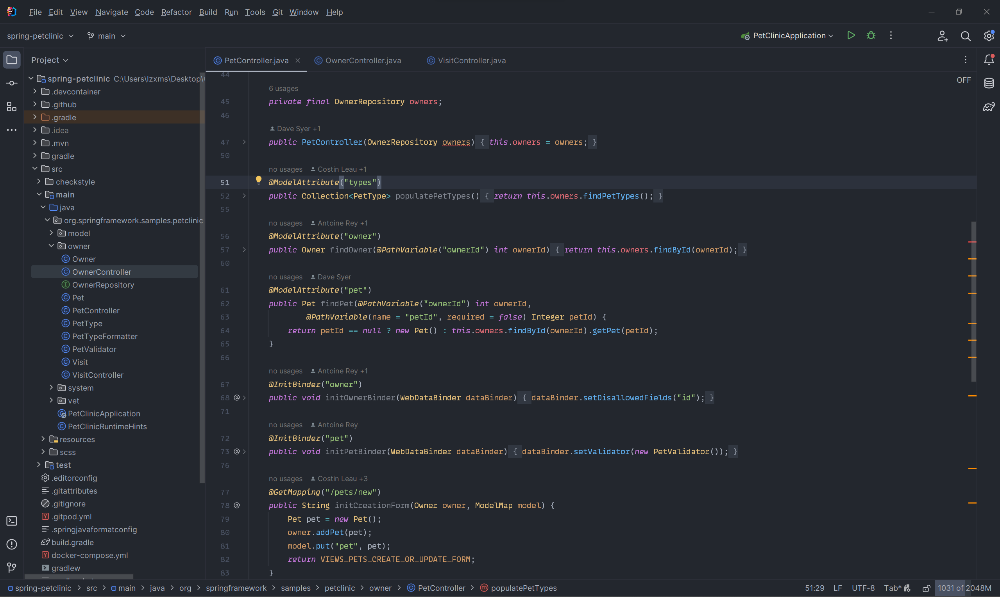

# One Dark Darker theme for JetBrains.

# Installation

Before starting make sure you have python 3.9 installed, it will **NOT** work with newer versions of python.

## Windows

### Python

To install python 3.9 you can use the [Microsoft Store](https://www.microsoft.com/store/productId/9P7QFQMJRFP7?ocid=pdpshare) or search for the installer on [python.org](https://www.python.org/). You can skip this step if you already have python 3.9 installed on your machine.

### Virtual Environment

To create and activate the virtual environment on Windows:

	$ python -m venv .venv
	$ .venv\Scripts\activate

## Linux

### Python

#### Ubuntu

To install python 3.9 you can follow this [tutorial](https://tellor.io/blog/how-to-install-python-3-9-and-venv-on-ubuntu/) by spuddy.eth. You can skip this step if you already have python 3.9 installed on your machine.

#### Other Distros

For other distros you will have to find out yourself how you install python 3.9.

### Virtual Environment

To create and activate the virtual environment on Linux:

	$ python -m venv .venv
	$ source .venv/bin/activate

## Installing requirements

To install the requirements for this project use the following command:

	$ pip install -r requirements.txt

## Usage

### Settings

You can change the settings of the theme in the `colors/dark.yaml` file. 

### Building

To build, use [sublate](https://github.com/espositocode/sublate):

    $ sublate

After building the theme you should have a output/jetbrains folder. Inside the output folder there should be a couple more folders, now you'll need to zip the contents of the resource folder into a .zip file. Make sure when you open the .zip file you see 3 folder: `META-INF`, `schemes` and `theme`. When everything checks out change the extension of the zip file to .jar.

### Importing

To import the theme into your preferred JetBrains Editor go to `File > Settings > Plugins` and click the 3 dots. There should be an option called `Install Plugin from Disk...`, select this option and select the .jar file you created earlier and your theme should be imported.